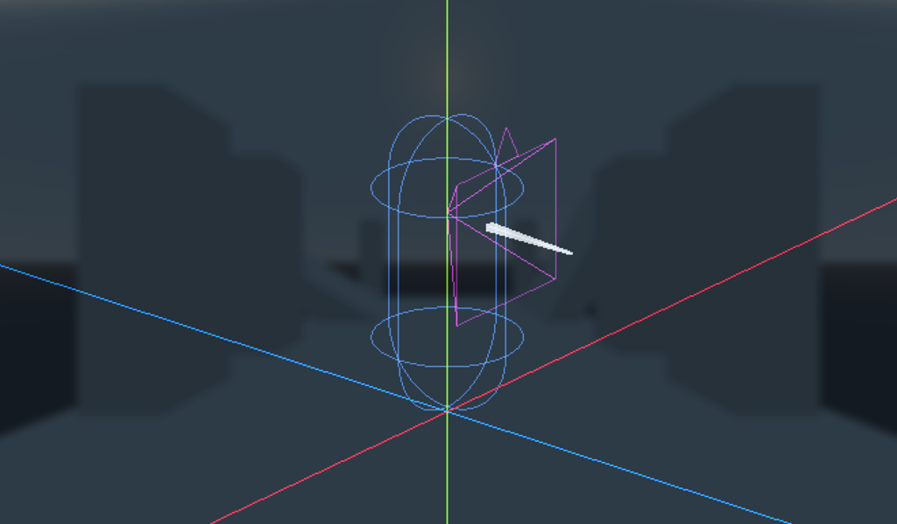

# gd_fpcc

[Play demo in browser!](https://menacingmecha.itch.io/gd-fpcc-demo)

First person character controller for Godot Engine 3.x

## Features

- Supports simultaneous KB+M & gamepad
- Interacting with objects in the environment (all you need for a walking sim right out of the box!)
- Supports smoothly walking up and down ramps, with no sliding down
- Camera viewbob
- Easily extendible
- [Covered by tests](test/)
